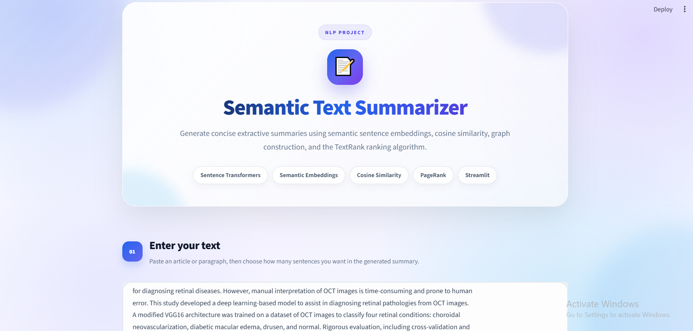
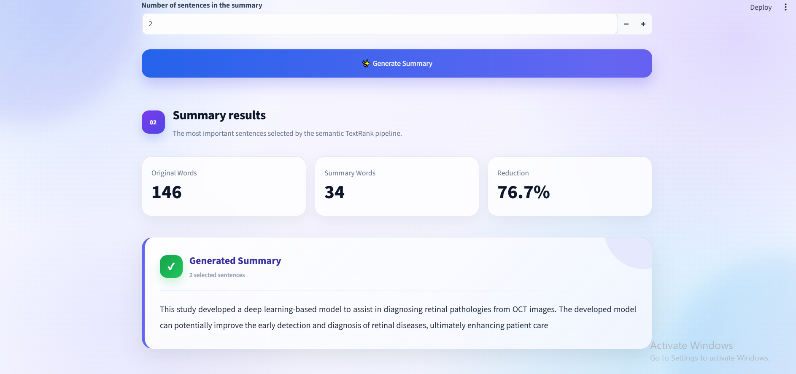
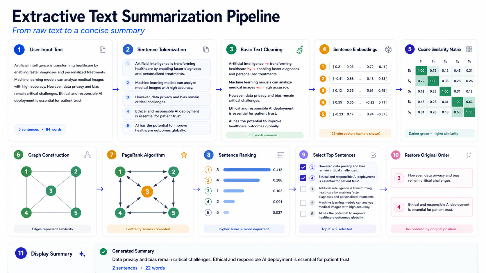

<div align="center">

# Semantic TextRank Summarizer

### Extractive text summarization using Sentence Transformers, cosine similarity, graph construction, and PageRank

[](https://semantic-textrank-summarizer-ib69w63qvjhdwrig9fhxwz.streamlit.app/)

</div>

## Application Preview



The application provides a clean Streamlit interface where users can paste a document, select the required summary length, and generate a concise extractive summary.

## Demo Video


## Generated Summary Preview



## Project Overview

**Semantic TextRank Summarizer** is an extractive Natural Language Processing application that identifies and selects the most important sentences from an input document.

Instead of generating new sentences, the system ranks the original sentences according to their semantic importance and restores the selected sentences to their original document order.

The project was developed as part of an Advanced NLP learning journey to demonstrate semantic embeddings, sentence similarity, graph-based ranking, and practical NLP deployment.

## Key Features

- Extractive text summarization using the original sentences.
- Semantic sentence embeddings using `distiluse-base-multilingual-cased-v2`.
- Sentence similarity calculation using cosine similarity.
- Graph construction with sentences represented as nodes.
- Sentence ranking using the PageRank algorithm.
- User-defined summary length from 1 to 15 sentences.
- Original word count, summary word count, and reduction percentage.
- Responsive Streamlit interface with a separate CSS file.
- Live deployment using Streamlit Community Cloud.

## How It Works



```text
User Input Text
      ↓
Sentence Tokenization
      ↓
Basic Text Cleaning
      ↓
Sentence Embeddings
      ↓
Cosine Similarity Matrix
      ↓
Graph Construction
      ↓
PageRank Algorithm
      ↓
Sentence Ranking
      ↓
Select Top Sentences
      ↓
Restore Original Order
      ↓
Display Summary
```

### Pipeline Explanation

1. **User Input** — the user enters a document or paragraph.
2. **Sentence Tokenization** — the document is divided into individual sentences using NLTK.
3. **Basic Text Cleaning** — sentences are converted to lowercase and English stopwords are removed.
4. **Sentence Embeddings** — each sentence is transformed into a semantic numerical vector.
5. **Cosine Similarity** — semantic similarity is calculated between every pair of sentences.
6. **Graph Construction** — sentences become graph nodes and similarity values become weighted edges.
7. **PageRank** — each sentence receives an importance score based on its relationship with the other sentences.
8. **Sentence Ranking** — sentences are ordered according to their PageRank scores.
9. **Top Sentence Selection** — the highest-ranked sentences are selected according to the requested summary length.
10. **Original Order Restoration** — selected sentences are returned to their original document order.
11. **Summary Display** — the final extractive summary and statistics are displayed in the Streamlit interface.

## Technology Stack

| Technology | Purpose |
|---|---|
| Python 3.11 | Core programming language |
| Streamlit | Interactive web interface and deployment |
| Sentence Transformers | Semantic sentence embeddings |
| Scikit-learn | Cosine similarity calculation |
| NetworkX | Graph construction and PageRank |
| NLTK | Sentence tokenization and stopword removal |
| NumPy | Similarity matrix operations |
| CSS | Custom interface design |

## Project Structure

```text
semantic-textrank-summarizer/
│
├── app.py
├── style.css
├── requirements.txt
├── README.md
│
└── assets/
    ├── img1.png
    ├── img 2.png
    ├── Media1.gif
    └── pipeline.png
```

## Installation

### 1. Clone the repository

```bash
git clone YOUR_GITHUB_REPOSITORY_URL
cd semantic-textrank-summarizer
```

### 2. Create a virtual environment

```bash
python -m venv .venv
```

Activate it on Windows:

```bash
.venv\Scripts\activate
```

Activate it on macOS or Linux:

```bash
source .venv/bin/activate
```

### 3. Install the dependencies

```bash
pip install -r requirements.txt
```

### 4. Run the application

```bash
streamlit run app.py
```

The local application will open at:

```text
http://localhost:8501
```

## Requirements

```text
streamlit==1.60.0
pandas==3.0.5
numpy==2.4.6
nltk==3.10.1
networkx==3.6.1
scikit-learn==1.9.0
sentence-transformers==5.6.1
```

## How to Use

1. Open the live application or run it locally.
2. Paste an article or paragraph containing several sentences.
3. Select the number of sentences required in the summary.
4. Click **Generate Summary**.
5. Review the generated summary and reduction statistics.

## Live Application

The deployed application is available here:

**https://semantic-textrank-summarizer-ib69w63qvjhdwrig9fhxwz.streamlit.app/**

## Current Limitations

- The system performs extractive summarization and does not generate new wording.
- The current preprocessing stage uses English stopwords.
- Very short inputs may not provide enough sentence relationships for meaningful PageRank ranking.
- The first execution can take longer while the Sentence Transformer model and NLTK resources are downloaded.

## Future Improvements

- Compare TextRank with an abstractive Transformer summarization model.
- Add multilingual preprocessing and language detection.
- Visualize the sentence-similarity graph inside the application.
- Add TXT and PDF file upload support.
- Evaluate performance using ROUGE metrics and benchmark datasets.
- Add summary download and copy options.

## Disclaimer

This project is intended for educational and demonstration purposes. The generated summary should be reviewed when used with important or sensitive documents.

## Author Note

This project is part of my ongoing learning journey in Advanced Natural Language Processing. It focuses on understanding semantic sentence embeddings, cosine similarity, graph-based ranking, and practical deployment with Streamlit.

---

<div align="center">

Built with Python, Sentence Transformers, TextRank, and Streamlit.

</div>
